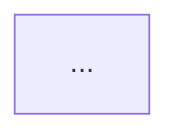

# Notes of a development project

The documentation of Кузня Миров (`C:\projects\obsidian\Проекты\Кузня Миров\`) is the model every project follows. Before writing a note, read the one model note of the same kind:

| Writing | Model note |
|---|---|
| architecture hub | `Архитектура Кузни/Архитектура Кузни.md` |
| area or module note about data and behaviour | `Архитектура Кузни/Экраны и состояние.md` |
| area note about layers and contracts between them | `Архитектура Кузни/Стек и инфраструктура.md` |
| concept | `Концепт Кузни.md` |

## Readers

The owner — a backend developer who does not know every domain — and later Claude sessions that plan phases from these notes. Both want to see how the system is built in a few minutes. Neither reads the implementation here: that is the phase note and the code.

## What goes where

| Content | Home |
|---|---|
| what the system must do, for whom, what it does not do | concept |
| the blocks of the system and how they work together | architecture hub |
| how one area works: its data (files, fields, keys), commands and calls between blocks, rules of behaviour, what is checked before start, boundaries, open questions | area or module note |
| why it is built this way, what was rejected | the journal, written by `/close-session` at the end of the session — never a note |
| what is built, statuses, progress | phase notes and the project card |
| implementation: exact message texts, order of calls inside one function, memory and latency calculations, per-field algorithms, library calls, advice to the system's users | phase note (feature-planner) or code |
| rules for keeping the documentation | the vault's CLAUDE.md, never a note |

Real case: the old Кузня sound notes carried the weight of a click sound in memory, a defending paragraph for each of seven steps of one engine call, and the text of every warning. A reviewer then found an arithmetic mistake in that weight — a mistake in content that did not belong in the architecture at all. The current note keeps the seven steps as seven one-line bullets and drops the rest.

## Form

- A set of things with the same attributes — fields, commands, calls, layers, files — is a table.
- How blocks or states interact is a mermaid diagram (`flowchart`, `sequenceDiagram`, `stateDiagram-v2`) of about a dozen nodes at most.
- Rules and behaviour are bullets: one fact per bullet, one or two lines.
- Prose appears only as a lead of one to four sentences: per block in the hub, under a heading in a note.
- Every note starts with frontmatter holding only `tags` (copy them from a sibling note), then `# <имя>`, then a link line to the hub and neighbours.
- `Открытые вопросы` is a short bullet list at the end of a note, one line per question. Questions the owner can answer now are asked in the chat instead.
- Wiki-links by note name only.
- None of these in the concept, the hub, area or module notes: status fields or progress markers («проработана», «в коде ещё нет»), history («раньше», «теперь», «новая таблица»), sections about how to keep the documents, hard line breaks inside a paragraph (Obsidian shows them as broken lines).

## Size

| Note | Limit |
|---|---|
| concept | ~40 lines |
| architecture hub | ~130 lines |
| area or module note | ~100 lines, 8 KB |
| phase outline | ~20 lines |

A note over its limit is cut: the why is deleted (the journal gets it from `/close-session`), the implementation moves to the phase, repetition is deleted. A note becomes a folder only when it holds two unrelated subjects — never to fit a limit. The whole Кузня architecture is seven notes, 47 KB.

## Words

- Short sentences in plain Russian.
- Names that are part of a contract — files, fields, keys, commands, calls between blocks, folders — are written as they are, in backticks: `screens.json`, `world_runs`, `["toggle_sound"]`. Internals of the implementation — private fields, database commands, internal key layouts, library functions — do not appear.
- Do not coin a nickname for a mechanism and build sentences on it. The old Кузня notes said «круг» 51 times and leaned on «сверка», «должное и исполненное», «хозяин проигрывателя»; the owner could not understand them. Say what happens instead. Incorrect: «Сверка сравнивает должное с исполненным.» Correct: «Страница сравнивает трек, который должен играть, с тем, что играет, и переключает.» A new term is allowed only when it names a real thing of the system; define it once where it first appears, in a table row or one sentence.
- An outside technical term (`WebGPU`, `JSON`) stays as is; one the owner may not know gets a few plain words on first use.
- No defence of the design inside a note: «и это не экономия слов», «путать это нельзя», «это обязательно». The reasons belong in the journal.

## Templates

Concept — `Концепт <Имя>.md`:

```markdown
---
tags:
  - <тег проекта>
  - концепт
---

# Концепт <Имя>

[[<карточка>]] · [[Архитектура <Имя>]] · [[Журнал <Имя>]]

## Что это

<одно-два предложения>

- **<аспект>:** <одна строка>

## Требования

1. **<требование>.** <одно-два предложения; ограничения и то, чего в системе нет, — тоже требования>
```

Architecture hub — `Архитектура <Имя>/Архитектура <Имя>.md`:

````markdown
---
tags:
  - <тег проекта>
  - архитектура
---

# Архитектура <Имя>

[[<карточка>]] · [[Концепт <Имя>]] · [[Фазы <Имя>]] · [[Журнал <Имя>]]

<одно предложение: что описано здесь и где подробности>

## Блоки системы



**<Блок>.** <2–4 предложения: что делает, с кем говорит, чего не знает.> → [[<заметка области>]]

## <Главный поток: запуск, запрос, кадр>

```mermaid
sequenceDiagram
  ...
```

<одно-два предложения о том, что важно в этом потоке>

## Границы между блоками

- <кто о ком не знает, что меняется при переносе на другую платформу>

## Заметки папки

```dataview
LIST
FROM "Проекты/<Имя>/Архитектура <Имя>"
WHERE file.name != this.file.name
SORT file.name ASC
```
````

Area or module note:

```markdown
---
tags:
  - <тег проекта>
  - архитектура
---

# <Область>

[[Архитектура <Имя>]] · [[<соседняя заметка>]]

## <Предмет>

<лид в одно-два предложения>

| Поле | Обязательно | Что это |
|---|---|---|

- <правило поведения>

## Проверка перед запуском

Ошибки — <что происходит>: <перечень случаев одной строкой каждый>.

## Границы

- <чего в области нет>

## Открытые вопросы

- <вопрос одной строкой>
```

Sections are named by the subject of the area; `Проверка перед запуском` appears only where data is checked, `Границы` and `Открытые вопросы` only when they have content.

Phase outline — `Фазы <Имя>/Фаза-NN-<короткое-имя-строчными-через-дефис>.md`:

```markdown
---
фаза: <N>
статус: планируется
tags:
  - <тег проекта>
  - фаза
---

# Фаза NN — <название>

[[Фазы <Имя>]] · [[Архитектура <Имя>]]

## Цель

<что хозяин сможет потрогать руками после фазы — одно-два предложения>

## Что входит

- <возможность> → [[<заметка области>]]

## Опирается на

<Фаза NN или «—»>
```
